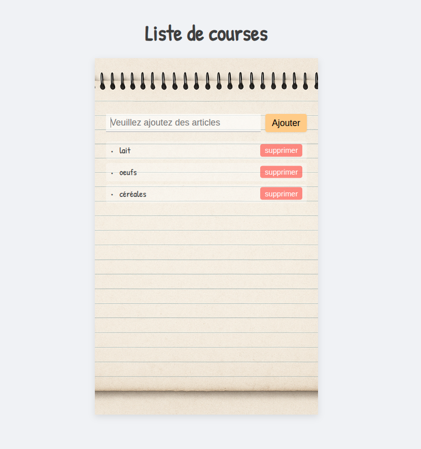

# Mini-Projet : Liste de courses

Une petite application web responsive permettant de gérer une liste de courses, réalisée en **HTML**, **CSS** et **JavaScript**.  
L’utilisateur peut ajouter et supprimer des articles, le tout dans un style de calepin manuscrit.

---

## Fonctionnalités

- Ajout d’articles à la liste
- Suppression individuelle d’un article
- Interface visuelle centrée et claire

---

## 📁 Structure du projet

├── index.html  
|── note-book.png
├── sass/  
│   └── main.css  
├── js/  
    └── script.js  

---

## ⚙️ Utilisation

1. Cloner ou télécharger ce projet  
2. Ouvrir `index.html` dans un navigateur  
3. Ajouter un article avec le champ texte + bouton **Ajouter**  
4. Supprimer un article avec le bouton **Supprimer**

---

## 🛠 Technologies utilisées

- **HTML5** (structure sémantique)
- **CSS3** (flexbox, fond personnalisé, animations simples)
- **JavaScript** (manipulation du DOM, événements)

---

## 📸 Aperçu

---

## 📄 Licence

Ce projet est libre pour un usage personnel, éducatif ou comme base d'apprentissage.
